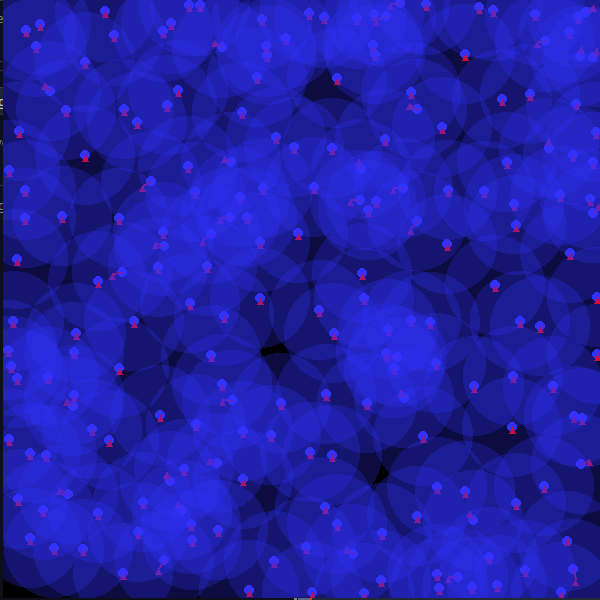

# FluidSim

## About 

**This project is currently under construction.**

FluidSim is a particle-based fluid simulation using Smoothed Particle Hydrodynamics (SPH) designed to demonstrate the concepts of fluid dynamics and collision detection in a 2D environment. It uses QuadTrees or a SpatialHashGrid for optimised collision detection, reducing the computational complexity of the simulation.

## Features

- Visualisations:
	- Utilises pygame for dynamic, real-time visual representation.

- Real-time 2D Fluid Simulation:

	- Demonstrates fluid movement and interactions in two dimensions.
	- Simulates various fluid behaviors and properties.

- Optimised Collision Detection:

	- Implements QuadTree or SpatialGridHashmap for efficient collision handling.
	- Minimises computational requirements for large-scale simulations.

- Advanced Fluid Dynamics:

	- Employs SPH for realistic fluid motion.
	- Calculates fluid density through gradients for precise particle velocity adjustments.

- Customisable Simulation Parameters:

	- Allows users to tweak simulation settings for different behaviors.
	- Adjustable visual parameters for diverse simulation experiences.

## Demo

**Smooth Particle Hydrodynamics**

Each particle is assigned a velocity vector based on the density of the fluid as indicated by the red arrow direction. The transparent spheres represnent the particles influcence as part of the principles of SPH.

**Rain Drops**

Each particle is dropped from a height and collides with each other using classical mechanics to distribute the forces to create an inelastic collision.

